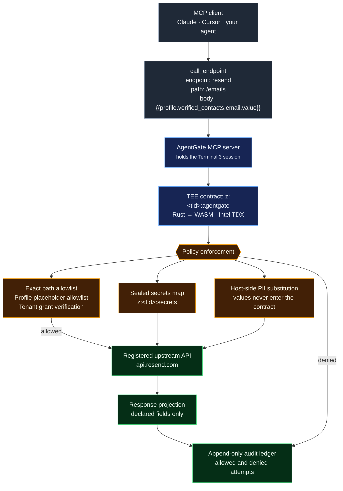

# AgentGate

**A governed tool-call gateway for AI agents, built on Terminal 3's ADK.**

Give an LLM agent an API key and it can call anything, spend anything, and leak
anything — and you find out afterwards, from the logs it wrote about itself.

AgentGate is the layer in between. You write down, once, which endpoints exist and what
each one is allowed to touch. The agent then asks for actions **by name**, and a Rust
contract running inside an Intel TDX enclave decides whether to carry them out.

The agent names an *endpoint*, not a URL. It never holds a credential. It never sees
the user's personal data. And every attempt it makes — allowed or denied — lands in a
ledger it cannot edit.

That last point is the one people miss: **denials are recorded too.** An agent probing
for what it can get away with leaves a trail.

It ships as an **MCP server**, so any MCP client (Claude Code, Claude Desktop, Cursor,
an SDK agent) gets governed tool calls by adding one config entry. No framework, no
rewrite.



## Where to look

| If you want | Read |
|---|---|
| **proof it works** | the receipt directly below — four real denials and a real delivered email |
| **how it works, and why the boundary sits where it does** | [`docs/ARCHITECTURE.md`](docs/ARCHITECTURE.md) — one call followed end to end |
| **what it costs and what to do when it breaks** | [`docs/HANDOVER.md`](docs/HANDOVER.md) — runbook written for a stranger |
| **the platform bugs found building it** | [`docs/BUGS.md`](docs/BUGS.md) — 13 findings, severity-indexed, each with a runnable reproduction in [`probes/`](probes/) |

Two Rust crates live here: [`contract/`](contract/) is the gateway;
[`contract-probe/`](contract-probe/) is a throwaway diagnostic used to map the platform's
behaviour, kept as evidence for the bug report.

## It works. Here is the receipt

`npm run demo` against T3N testnet — every call below is made by the org-minted agent:

```
🛑 DENIED   profile field outside the endpoint's allowlist  ({{profile.ssn}})
            marker rejected: 'ssn' is not in this endpoint's allowed_placeholders
🛑 DENIED   marker reaching for another namespace  ({{secret.resend_api_key}})
            marker rejected: 'secret.resend_api_key' is not a profile marker
🛑 DENIED   path the tenant never enumerated  (/domains)
            path rejected: '/domains' is not in this endpoint's allowed_paths
🛑 DENIED   endpoint that does not exist  (stripe)
            unknown endpoint

── policy is per-ENDPOINT, not per-host ──────────────────────────────
   'resend' and 'resend-notify' share a host AND a credential.
   The same marker is allowed on one and refused on the other.

✅ ALLOWED  {{profile.first_name}} via 'resend'        (allowlisted there)
            {"data":{"id":"d7299ce6-668f-47f2-8e22-8f3f96c0f255"},"status":200}
🛑 DENIED   {{profile.first_name}} via 'resend-notify' (allowlist is empty)
            marker rejected: 'first_name' is not in this endpoint's allowed_placeholders
✅ ALLOWED  no markers via 'resend-notify'             (allowed, returns nothing)
            {"data":{},"status":200}
```

Real emails were delivered. The recipient's address and name were resolved inside the
enclave from the data owner's profile — they appear nowhere in the agent's input, the MCP
transport, the contract's memory, or the ledger.

The last line is the deny-by-default response projection: `resend-notify` declares no
`response_fields`, so a successful call returns a status code and an empty object. Even the
upstream's message id is withheld.

The ledger afterwards:

```
denied     0  resend/emails         markers=["profile.ssn", …]        'ssn' not allowed here
denied     0  resend/emails         markers=["secret.resend_api_key"] not a profile marker
denied     0  resend/domains        markers=[]                        path not enumerated
denied     0  stripe/emails         markers=[]                        unknown endpoint
ok       200  resend/emails         markers=["first_name","last_name","verified_contacts.email.value"]
denied     0  resend-notify/emails  markers=["profile.first_name", …] 'first_name' not allowed here
ok       200  resend-notify/emails  markers=[]
```

Marker *names* are recorded. Marker *values* were never available to record.

## Quick start

```bash
npm install
cp .env.example .env          # add your T3N_API_KEY from terminal3.io/claim-page
npm run test                  # 9 native policy tests, no network, no credits
npm run build                 # Rust → wasm32-wasip2
npm run deploy                # idempotent — safe to re-run
npm run doctor                # pre-flight a deployment you didn't just create
npm run demo                  # the run shown above
```

Add to any MCP client:

```json
{ "mcpServers": {
    "agentgate": { "command": "npx", "args": ["tsx", "/path/to/agentgate/mcp/server.ts"] } } }
```

## Adding an endpoint

One file. No Rust, no redeploy of the contract.

```jsonc
// agentgate.config.json
"endpoints": {
  "stripe": {
    "base": "https://api.stripe.com",
    "secret_key": "stripe_api_key",        // key in z:<tid>:secrets
    "auth_header": "Authorization",
    "auth_prefix": "Bearer ",
    "allowed_paths": ["/v1/customers"],    // exact match only
    "allowed_placeholders": ["first_name", "verified_contacts.email.value"],
    "response_fields": ["id"]              // everything else is dropped
  }
}
```

Then `npm run deploy`. It skips contract registration when the wasm is unchanged, so
adding an endpoint costs ~800 credits rather than paying for a re-registration
([measured](docs/BUGS.md); the figure this README originally carried was wrong by 5x).

## Why the design is shaped this way

Three decisions came out of measuring the platform, not reading about it:

- **Denials return `Ok`, never `Err`.** Contract writes roll back on error, so returning
  `Err` on a policy denial would roll back the audit entry recording that denial — an agent
  could trip the policy repeatedly and leave no trace.
- **Responses are projected, not passed through.** `http-with-placeholders` protects the
  *outbound* leg only. The upstream response returns into WASM in full, so an endpoint that
  echoes its request hands back the PII the markers withheld. Demonstrated in
  [`docs/BUGS.md`](docs/BUGS.md).
- **The contract sets no `Content-Type`.** The host appends its own rather than replacing
  yours, producing `application/json,application/json`, which strict upstreams reject —
  silently, with an HTTP 200 and an empty body. See [`docs/BUGS.md#1`](docs/BUGS.md).

## Repo layout

| Path | What |
|---|---|
| `contract/` | the TEE contract — `policy.rs` is pure and natively tested, `gateway.rs` talks to the host |
| `mcp/server.ts` | MCP server — 3 tools |
| `scripts/deploy.ts` | idempotent deploy; owns the `contract_id` ledger |
| `scripts/doctor.ts` | pre-flight health check |
| `scripts/demo.ts` | the run shown above |
| `agentgate.config.json` | every endpoint and grant, declaratively — this is the file you edit |
| `.mcp.json` | drops the server into any MCP client that reads it, no setup |
| `deployments.json` | committed ledger of every `contract_id` ever issued |
| `probes/` | one runnable script per platform bug — reproductions, not tests |
| `docs/BUGS.md` | 13 findings against the platform, each with a reproduction |
| `docs/ARCHITECTURE.md` | **start here** — one call followed end to end, and why the boundary sits where it does |
| `docs/HANDOVER.md` | runbook for whoever operates this next |
| `contract-probe/` | throwaway diagnostic that mapped the platform's behaviour — evidence for the bug report, [not something to build on](contract-probe/README.md) |

## Status

Built and verified end-to-end against T3N testnet with `@terminal3/t3n-sdk@5.2.0`, running the
full three-identity flow:

| Principal | Holds | Role in the run above |
|---|---|---|
| **Tenant** | eth key, funded | owns the contract, seals the credential, enumerates the policy |
| **Data owner** | own DID + profile | grants the agent; the markers resolve against their profile |
| **Agent** | an opaque bearer token, nothing else | makes every call shown above |

The agent's signing key was minted inside the TEE and never left it. It holds no API key, no
URL, and no personal data, and cannot reach a core contract to inspect its own grants — yet it
delivers a personalised email to a real inbox.

Getting there required Terminal 3 to fund the agent DID by hand: a minted agent starts at zero
and one call reserves 10,000 tokens, with no self-serve top-up ([`docs/BUGS.md#10`](docs/BUGS.md)).
Every developer will hit that on their first agent.
