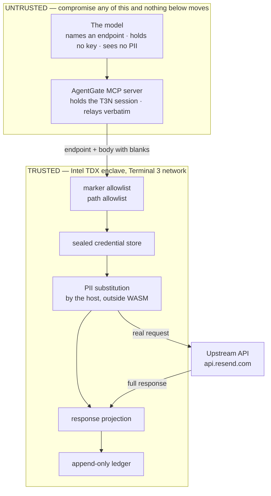

# Architecture

## In one sentence

The agent asks for an action by name; a piece of hardware it cannot reach decides
whether that action is allowed, fills in the private data, and writes down what
happened.

## The problem

An AI agent that does real work needs two things that pull against each other: enough
access to be useful, and enough restraint to be safe.

The normal way to build this is to put the API key in the agent's environment and the
rules in the agent's prompt. Both fail the same way — **the thing being restrained is
holding the restraints.**

- A prompt rule is a *suggestion*. An agent that ignores it, or is talked into ignoring
  it, meets no resistance.
- The audit log is written by the same process. A misbehaving agent's account of itself
  is exactly as trustworthy as the agent.
- The API key sits in a variable the agent can read. So can anything that compromises
  the agent.

AgentGate moves all three — the rules, the key, and the log — to the other side of a
boundary the agent has no path across.

## Follow one call

The agent wants to email a user. Here is everything it says:

```json
{
  "endpoint": "resend",
  "path": "/emails",
  "body": {
    "from": "onboarding@resend.dev",
    "to":      ["{{profile.verified_contacts.email.value}}"],
    "subject": "Welcome, {{profile.first_name}}",
    "html":    "<p>Hi {{profile.first_name}}, your account is ready.</p>"
  }
}
```

Note what is *not* in there. No URL. No API key. No email address. The agent named an
endpoint and left blanks where the private data goes.

That request travels through the MCP server (which just relays it) into a Rust contract
running inside an Intel TDX enclave on Terminal 3's network. Inside the enclave, six
things happen in order:

| # | Step | What it stops |
|---|---|---|
| 1 | Every `{{…}}` marker is checked against this endpoint's allowlist | `{{profile.ssn}}` — a field this endpoint has no business reading |
| 2 | Markers must live in the `profile.` namespace | `{{secret.resend_api_key}}` — a marker reaching for the credential store |
| 3 | The path must be one the tenant wrote down, matched exactly | `/domains` — a real Resend endpoint nobody authorised |
| 4 | The credential is read from a sealed map inside the enclave | the key never enters a variable the agent could return |
| 5 | The host substitutes the real values and makes the call | the plaintext email address never exists in contract memory |
| 6 | The reply is cut down to the fields the endpoint declared | an upstream that echoes your request back can't leak it |

Then the ledger entry is written — **whether the call was allowed or denied.**

If any check fails, the call stops there and the agent gets back a reason. The email
address was never fetched, the key was never read, and the denial is now on the record.

## The boundary



Everything inside the trusted box is enforced by the enclave. Compromising the agent
process, the MCP server, or the developer's laptop moves none of it.

## What each rule stops, and where it lives

| Attack | Stopped by | Code |
|---|---|---|
| Agent exfiltrates the API key | credential is read inside the enclave and never returned | `gateway.rs` |
| Agent calls an unintended host | egress resolved from the data owner's grant | T3N host |
| Agent calls an unintended path on an allowed host | exact-match path allowlist | `policy::resolve_path` |
| Agent reads a profile field it shouldn't | per-endpoint marker allowlist | `policy::check_markers` |
| Agent injects `{{secret.…}}` to reach another namespace | namespace check before the host ever sees it | `policy::check_markers` |
| Upstream echoes PII back to the agent | response cut to declared fields | `policy::filter_response` |
| Agent hides its own denials | ledger written on the `Ok` path — see below | `gateway::denied` |

Everything in the `policy::` column is pure Rust with no host dependencies, so it runs
under `cargo test` on your laptop in milliseconds — no network, no credits. That is
where the 9 tests live.

## Three decisions that came from measuring the platform

Not from reading the docs. Each of these was a surprise.

### Denials return `Ok`, never `Err`

T3N rolls back everything a contract wrote when the function returns an error.

So returning `Err` on a policy denial would roll back **the audit entry recording that
denial**. An agent could probe the policy surface all day — every rejected field, every
forbidden path — and leave nothing behind.

`invoke_endpoint` therefore returns `Ok({outcome: "denied", reason, audit_key})` and the
ledger write commits. Only genuinely unrecoverable conditions — malformed input, a
missing secret — return `Err`, and no agent can trigger those selectively.

### Responses are cut down, not passed through

`http-with-placeholders` substitutes PII into the **outbound** request. It says nothing
about the response, which comes back into WASM in full.

Plenty of APIs echo your request back to you. Such an endpoint hands the contract
exactly the plaintext the placeholder mechanism was protecting. We demonstrated this
directly — see the design note in [`BUGS.md`](BUGS.md).

So every endpoint declares `response_fields`, and everything else is dropped before the
result leaves the enclave. Declare nothing and you get a status code and an empty object.
Deny-by-default, because the opposite default fails silently.

### The contract sets no `Content-Type`

The host **appends** its own `Content-Type` rather than replacing yours, producing
`application/json,application/json`. That is not a valid media type. Strict upstreams
drop the body and return HTTP 200 with nothing parsed — a silent failure.

This is [`BUGS.md#1`](BUGS.md), and it affects Terminal 3's own reference contract.
AgentGate sets only `Authorization` plus whatever an endpoint declares in
`extra_headers`.

## Why a gateway and not an agent

The obvious build here is one vertical agent — HR onboarding, invoice approval, support
triage. We built the layer underneath instead, because **the guardrail is the reusable
part and the vertical is not.**

Shipping as an MCP server means any existing agent gets governed calls by adding one
config entry. No framework commitment, no rewrite. `scripts/demo.ts` is the vertical
example, and it is ~60 lines and disposable.

## Identity model

Three principals, and the platform creates each one differently. The docs imply you
claim all three; the claim page issues one.

| Principal | How it is created | Authenticates with | Starting balance |
|---|---|---|---|
| **Tenant** | claim page (SSO) | `T3nClient` session — SIWE over an eth key | funded |
| **User** (data owner) | any secp256k1 keypair; DID minted on first `authenticate()` | `T3nClient` session | 0 |
| **Agent** | `createOrganisation()` → `createAgent()`; signing key minted inside the TEE and never exported | a bearer token, nothing else | 0 |

The data owner grants the agent access to specific functions on a specific contract,
scoped to specific hosts. The agent authenticates as *itself* and acts *for* a subject
(`pii_did`) — the markers resolve against that subject's profile.

Authentication is not authorization. A valid agent token proves who is calling and
nothing about what they may do.

In this deployment the tenant DID stands in as data owner and caller, because a freshly
minted agent cannot pay for its first call ([`BUGS.md#10`](BUGS.md)). The grant to the
agent DID is already applied; funding it is the only step between here and full
separation.

## Why the tooling looks the way it does

Two facts about this platform shaped `scripts/` more than anything else:

1. Re-registering a contract tail mints a **new** `contract_id`, and no API tells you a
   tail's current id.
2. Map ACLs are scoped to that id, and no API reads an ACL back.

Put those together: the most likely production failure — a redeploy leaving the contract
unable to read its own secrets — is **invisible to every introspection path the platform
offers.**

So `scripts/deploy.ts` keeps the id ledger itself, in `deployments.json` (committed), and
re-applies every map ACL on every single run. The failure cannot occur because the repair
is unconditional. `scripts/doctor.ts` then verifies it *functionally* — it asks the
contract to read one of its own maps — rather than trusting metadata that does not exist.

That is also why `deploy` is the repair tool and not just the install tool. When
something is wrong, running it again is usually the answer.
